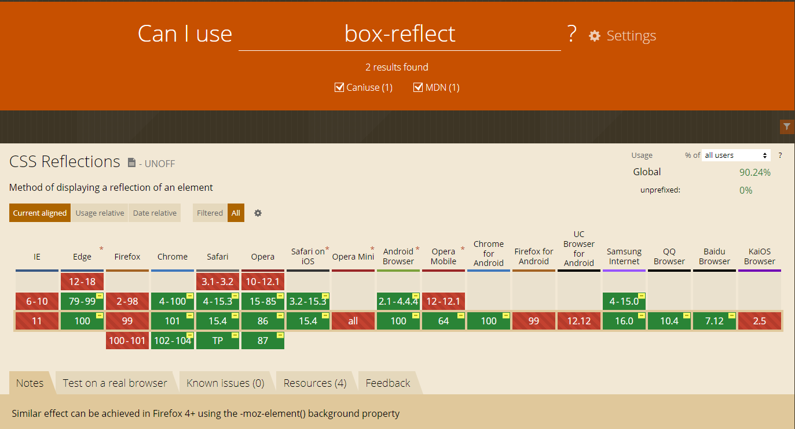

#### box reflect (2022-04-28)

`box-reflect` จริง ๆ เวลาทำงานจริง ๆ ไม่ค่อยได้เล่นกับรูปเท่าไหร่เลย property ที่ใช้รูปก็มีเยอะมากที่ไม่เคยได้ใช้แต่เริ่มจากอันนี้ก่อนเพราะเหมือนเคยเค้าทำได้ว่าเคยทำ แล้วให้ `div` 2 อันใส่คนละรูปแล้ววางใกล้กัน ฮ่า ๆ

`box-reflect` คืออะไรก็ตามชื่อเลย มีไว้ทำภาพสะท้อน สามารถกำหนด ทิศทางได้โดยเลือก `below` `above` `left` `right`
เราสามารถ กำหนด gap ระหว่าง ภาพจริงกับภาพสะท้อนได้ด้วยการใส่ ขนาดลงไปเช่น `10px`และสามารถใส่ gradient ตามหลังเพื่อ fade ให้เงาสะท้อนดูสมจริงมากยิ่งขึ้น

**ตัวอย่าง**


**code example**

```css
-webkit-box-reflect: below 0px linear-gradient(to bottom, rgba(0, 0, 0, 0), rgba(0, 0, 0, 0.4));
```

ฺ
**Browser ที่ support**

แน่นอน ```box-reflex``` support ไม่ทุกอัน 


แต่สามารถใช้ prefixes ได้อยู่

```css
-webkit-
-moz-
-ms-
-o-
```

เช็คอัพเดทได้ที่ [can i use box-reflect](https://caniuse.com/?search=box-reflect)


